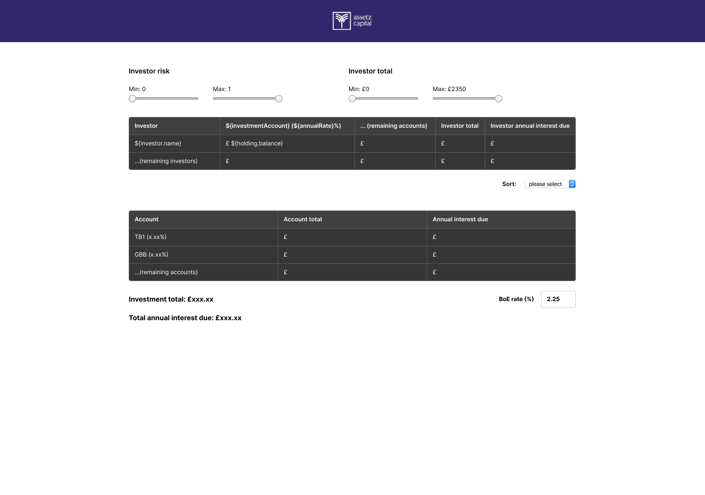
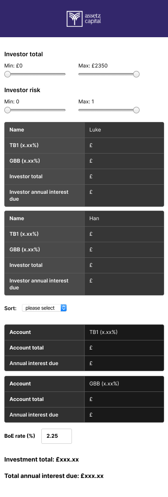

# Frontend Challenge

This is the frontend technical challenge for candidates applying for an engineering role at Assetz Capital.

Please also read the [guidance](../README.md#guidance) and instructions for [submitting your task](../README.md#submitting-your-task).


## Task

Write a frontend application in TypeScript that fetches (via an HTTP request) and displays
[investor holdings](https://raw.githubusercontent.com/AssetzSMECapital/technical-challenge/master/data/holdings.json) while:
1. Having a responsive layout
   - See desktop and mobile designs for guidance
2. Having the following filters:
   - Investor `riskLevel` range (min/max value)
   - Investor holdings `Investor Total` range (min/max value)
3. Having the following sorting:
   - Asc/desc by the `Investor Total`
   - Asc/desc by the investors' `name`
   - Default/no sorting
   - **Note:** filters and sorting should be compatible with one another.
4. Having a BoE (Bank of England) rate input field that should be applied on top of the investment account rate. 
   - The default BoE rate should be 2.25%
   - **Note:** The BoE rate should be applied to all interest rates before making
     any calculations. In the mockup this is shown as `${annualRate}` and
     anywhere a percentage is shown such as `TB1 (x.xx%)`
5. A summary section containing;
   - The `Investor Total`, sum of all investor holdings (after
     filters)
   - The `Total annual interest due`, sum of all intrest due (after
       filters)

You do not need to implement the design exactly, but it should be similar in
appearance and layout. You may use any libraries or frameworks that you wish.

### API Information

The investor holdings can be retrieved at:

https://raw.githubusercontent.com/AssetzSMECapital/technical-challenge/master/data/holdings.json

And have the format:
```
{
    "id": number,
    "investorId": number,
    "investmentAccount": string,
    "balance": string
}
```

The investors can be retrieved at:

https://raw.githubusercontent.com/AssetzSMECapital/technical-challenge/master/data/investors.json

And have the format:
```
{
    "id": number,
    "name": string,
    "riskLevel": number
}
```

The investment account rates can be retrieved at:

https://raw.githubusercontent.com/AssetzSMECapital/technical-challenge/master/data/rates.json

And have the format:
```
{
    "id": number,
    "investmentAccount": string, 
    "annualRate": number
}
```

### Designs

#### Desktop layout



#### Mobile layout


